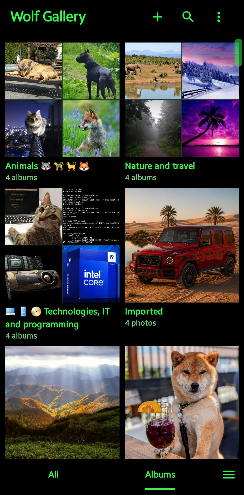
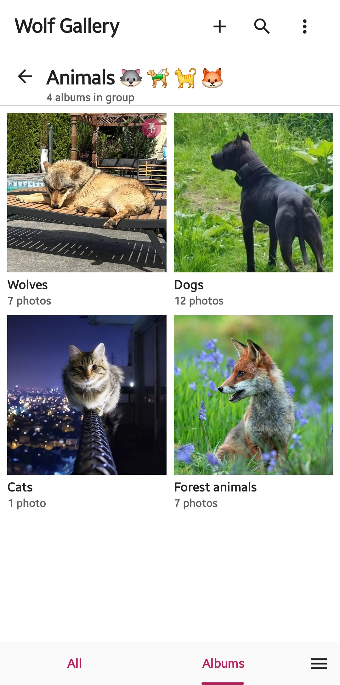
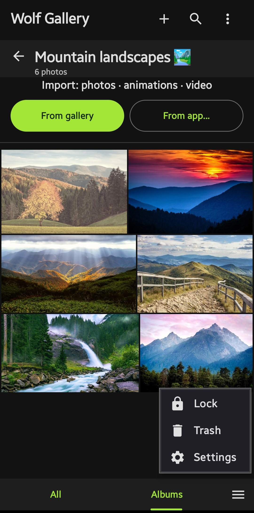
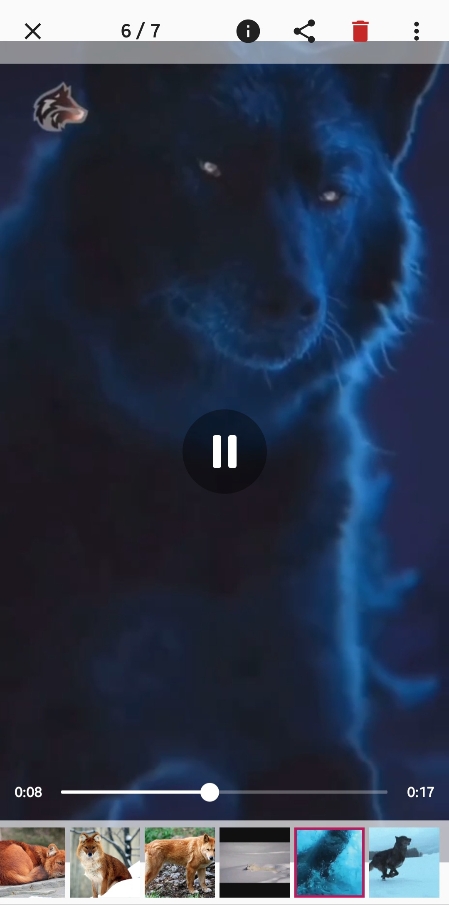
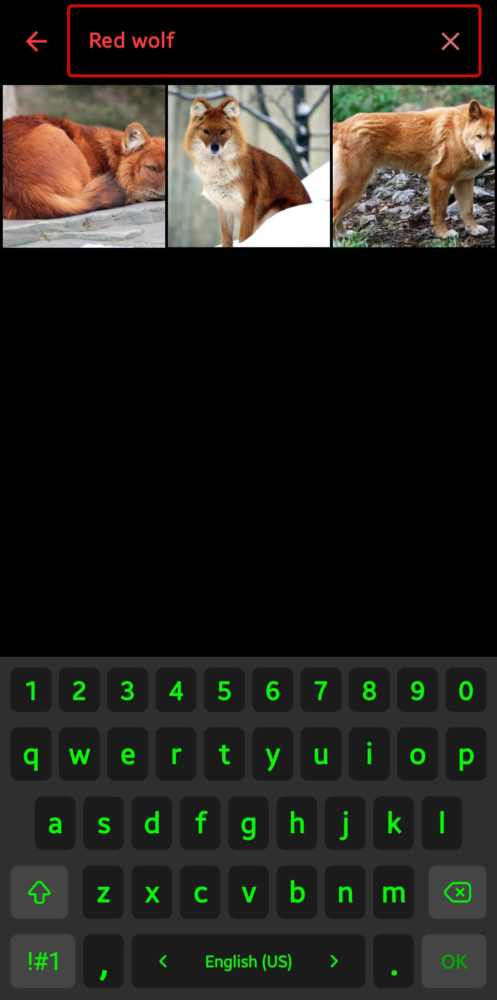
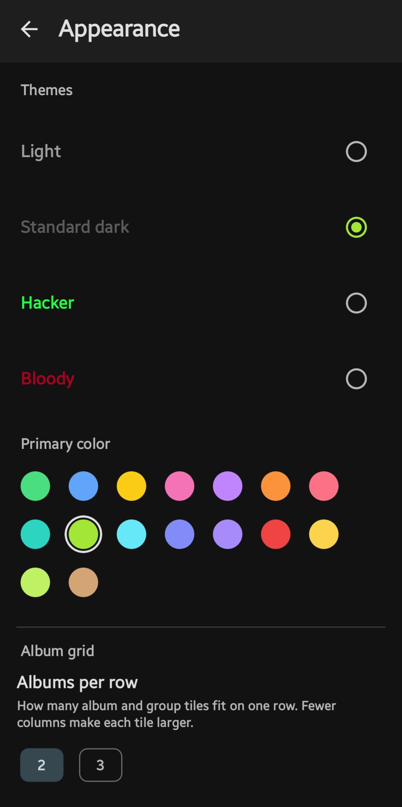
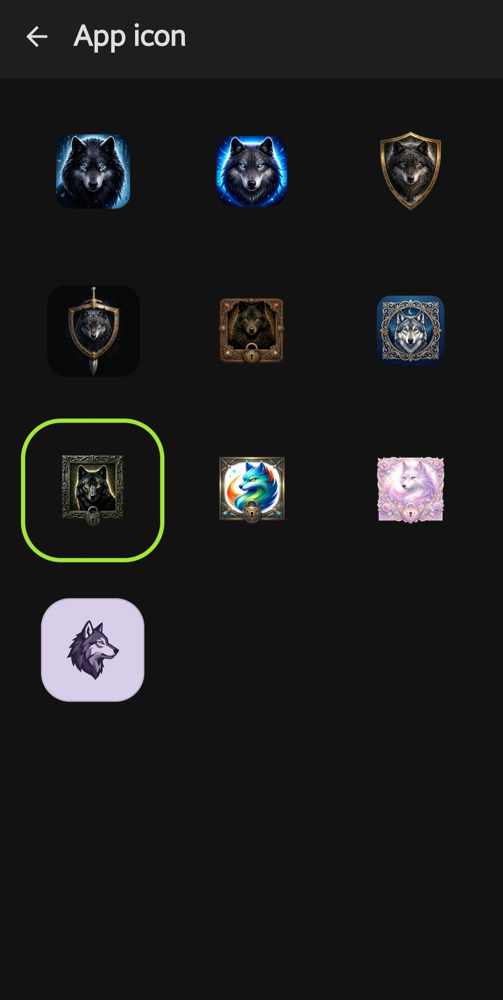
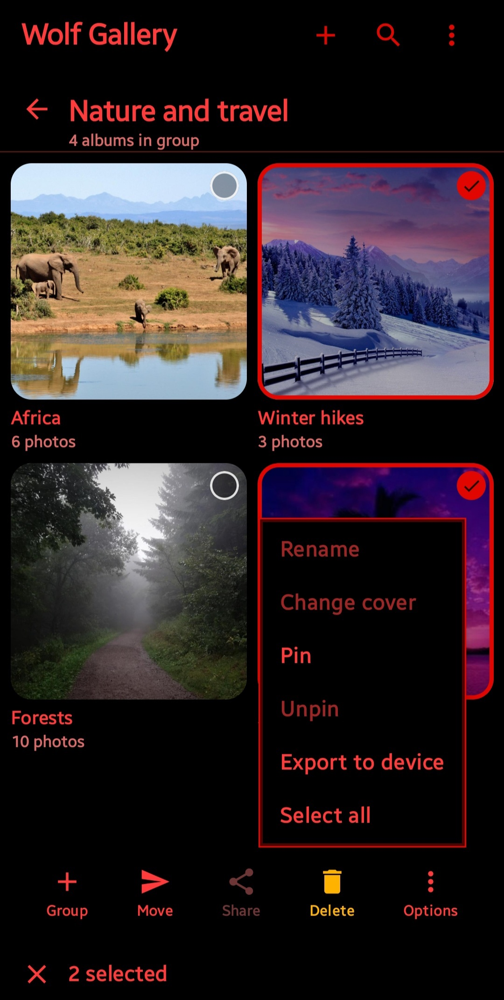

<div align="center">

# 🐺 Wolf Gallery

**Security · Convenience · Comfort · Personalization — in one gallery.**

[](LICENSE)
-3ddc84)


</div>

## Download

<div align="center">

<a href="https://github.com/Wolf-Project777/wolf-gallery/releases/latest"></a>

<a href="https://apps.obtainium.imranr.dev/redirect?r=obtainium://add/https://github.com/Wolf-Project777/wolf-gallery"></a>

<sub>IzzyOnDroid and F-Droid coming soon.</sub>

</div>

---

## Why Wolf Gallery

Pick any gallery app and you usually face a trade-off. The secure ones are bare — a locked box with nothing else. The pretty, comfortable ones with themes and layout options keep your photos wide open. You rarely find one app that is **secure *and* convenient *and* comfortable *and* personal** at the same time.

Wolf Gallery is built to be exactly that. Strong, modern encryption underneath; a flexible, comfortable interface on top. It does everything you need to shape it around your own preferences — without ever asking you to give up security to get there. Even sharing a file or setting a wallpaper happens straight from the encrypted vault, so your media stays protected right up to the moment you choose to use it. And because it pulls security, convenience, and personalization into one place, you can make it your main gallery in place of the stock one — or keep it alongside as a private vault for what matters most.

And this is only the beginning — **Wolf Gallery is actively evolving, with a lot more ahead.**

## Screenshots

|  |  |  |  |
|:--:|:--:|:--:|:--:|
|  |  |  |  |
| Albums grouped by topic | Inside a group · light theme | Photos, animations & video | Create albums, groups & import |
|  |  |  |  |
| Sort & manage albums | Flexible import · one-tap lock | Auto-lock & screenshot protection | Multi-select: rename, pin, cover, export |

## Features

**🔒 Security**
- Every file is encrypted and kept in an isolated vault.
- 100% offline — no internet permission, no accounts, no cloud, no telemetry.
- Screenshots and Recents previews are blocked (`FLAG_SECURE`).

**🗂️ Convenience — organize your way**
- **Groups & albums** — build albums and groups directly inside Wolf Gallery, then move albums into whichever group fits.
- **Rename freely** — relabel any group, album, or individual file.
- **Emoji in names** — drop emoji and symbols into the names of groups, albums, and files.
- **Order & sorting** — arrange and sort your groups, albums, and files to taste.
- **Search** — find groups, albums, and files by name.
- **Pinning** — pin and unpin groups and albums to keep favorites within reach.
- **Album covers** — set any picture as a cover and frame the exact part of it you want on display.
- **Import & export** — bring files and albums in from the device, or send them back out — you decide where your media lives.
- **Share from the vault** — send any file to another app right from inside Wolf Gallery, with no need to drop it into open storage first.
- **Set as wallpaper** — apply a picture to your home screen straight from the gallery.

**🎨 Personalization**
- **Themes & colors** — several themes, including pure-black dark modes, paired with a custom accent color.
- **Grid density** — set how many albums and thumbnails sit in a single row.
- **Shape** — switch thumbnails and albums between rounded and square corners.
- **Bar placement** — keep the search/action bar up top or down low, whichever suits your grip.

**🧩 Comfort**
- A built-in **trash** so deletions can be undone.
- A guided **first-run wizard** for an effortless start.
- Available in **several languages**, with more translations on the way.

## Security

### Encryption

- **AES-256-GCM** authenticated encryption — protects both the *confidentiality* of your files and their *integrity* (any tampering is detected on decryption).
- **Argon2id** key derivation — the memory-hard winner of the Password Hashing Competition. Your passphrase is stretched into a key that is expensive to brute-force on GPUs and ASICs; the key itself is never stored in plaintext.
- **Hardware-backed keys** — the master key lives in the Android Keystore (StrongBox-backed where available), and AES runs on the CPU's hardware crypto extensions for speed.
- **Optional post-quantum mode** — an opt-in **ML-KEM-768 + AES hybrid** (NIST FIPS 203) for key protection that stays secure even against future quantum adversaries. On its own, AES-256 already retains a ~128-bit security margin under Grover's algorithm — a comfortable cushion for the foreseeable future; the hybrid mode is there for those who want a genuine post-quantum guarantee.
- **Native crypto core** — all cryptographic operations run in C/C++ with locked memory (`mlock`) so secrets are kept out of swap and wiped after use.

> **Performance note:** encryption, decryption, and import speed scale with your device's CPU and available RAM. Argon2id is *deliberately* memory-hard, so stronger settings cost more time on lower-end hardware — that cost is the security.

### Isolation

Your media is stored in an **isolated, encrypted vault** inside the app's private storage. Other apps, the system gallery, and media scanners **cannot see or read** the files you bring into Wolf Gallery — to the rest of the device, the vault is just opaque ciphertext.

### Security model

**What Wolf Gallery protects:**
- **Your data at rest** — every file in the vault is encrypted; nothing is readable without your passphrase.
- **Against other apps** — the vault is isolated and invisible to the rest of the system.
- **Against device loss or seizure** — without your passphrase the vault is unreadable, and forensic extraction yields only ciphertext.
- **Against casual access** — screenshots and Recents previews are blocked, and repeated wrong attempts are slowed by exponential backoff (with an optional wipe-after-N-failures).

**How it protects:**
- Authenticated AES-256-GCM encryption (confidentiality + tamper detection).
- Keys derived from your passphrase with Argon2id — never stored in plaintext.
- Hardware-backed key storage (Android Keystore / StrongBox).
- A native crypto core with locked, scrubbed memory.
- App-integrity hardening on startup.

### Staying secure

Wolf Gallery secures your data **at rest**. As with any on-device encryption, that protection also rests on the device it runs on — so keep yours trustworthy:

- Use a **long, unique passphrase** you don't reuse anywhere else.
- Keep your device **updated** and install apps only from sources you trust.
- **Guard against malware** — keep your device clean of viruses and malicious apps with whatever protection you trust; there's no one-size-fits-all tool, so the choice stays yours.
- Enable your device's **lock screen** and **full-disk / file-based encryption**.
- Make use of the app's **auto-lock** and don't leave the vault open and unattended.

## Privacy

Wolf Gallery has **no `INTERNET` permission** — it physically cannot phone home. No accounts, no sync, no cloud, no analytics, no trackers. Your library never leaves your device.

## Build

Open this directory in **Android Studio** (Panda 4 / 2025.3.4 or newer). Gradle sync downloads the wrapper automatically.

- **Min SDK:** 28 (Android 9 Pie)
- **Language:** Kotlin + Jetpack Compose, with a native (C/C++) crypto core via the NDK.

## License

[GPL-3.0-only](LICENSE).

## Support development

Wolf Gallery is free, open-source, and has no ads, accounts, or trackers. If it's useful to you, a donation helps it keep evolving. Privacy-first coins only — no KYC, nothing custodial. The same addresses live inside the app under *Settings → Support development*, with offline QR codes.


```
42nfQ6zMT9jbLM2XGwNLLX137s8RkYRrhhJSqrFFZvCwcWegttcMQJZ85gTG6niredYWfRP6FYoEtPKYDDWQ63CM8hT5xzK
```


```
u1hwe88n4r8zz8958ssr02swq3svxmpqxq5uzhn3sp3zkjna39ymphtkc4egc2w0s4pxvhemmw2cw89gz7qzkzxvhnhrywwhm0aaq706h0a8p7jc447m59nululu77y42x2u6n056jwyvclphau2tu9jayt4c4szzkrjh5vxtrd587rx65
```

## Contact

Feedback and questions: **wolf-project777@protonmail.com**

---

<div align="center">

Part of **🐺 Wolf Project** — *non-custodial · encrypted · anonymous · open-source.*<br>
Nothing phones home.

</div>
